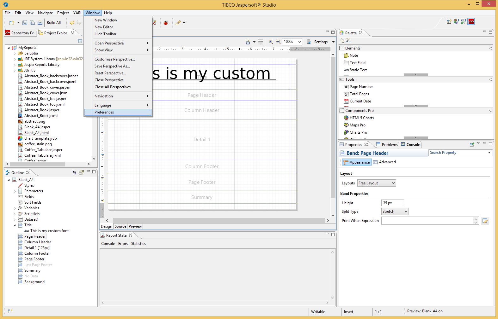
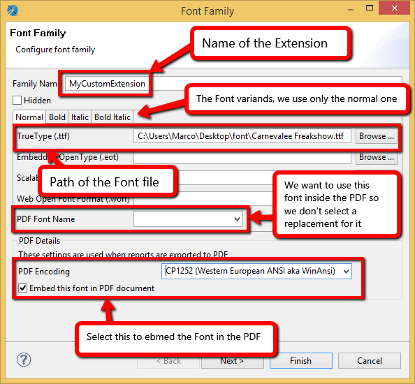
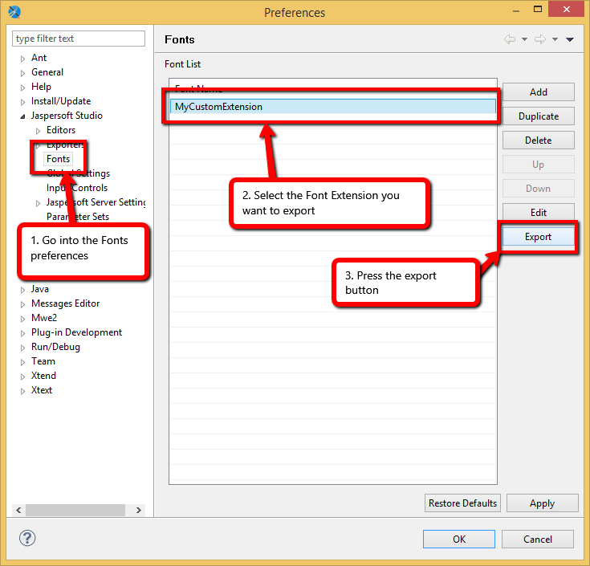
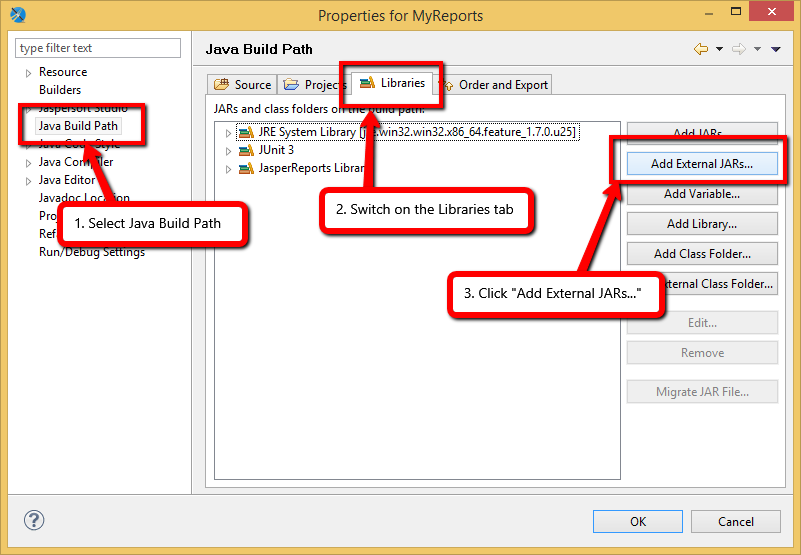

### Documentation

* [JasperReports font properties](https://jasperreports.sourceforge.net/sample.reference/fonts/)
* [JasperReports `Font Extension`](https://jasperreports.sourceforge.net/sample.reference/fonts/#fontextensions)
* [Custom Font with the Font Extension](https://community.jaspersoft.com/wiki/custom-font-font-extension)

### Steps to apply:

* [Options and motivation of having JasperReports `Font Extension`](#options-and-motivation-of-having-jasperreports-font-extension)
* [Create the Font Extension](#create-the-font-extension)
* [Export the Font Extension](#export-the-font-extension)
* [Import the Font Extension into Jasper Studio](#import-the-font-extension-into-jasper-studio)
* [Import the Font Extension into your project](#import-the-font-extension-into-your-project)
* [Make the new font as a default one]

### Options and motivation of having JasperReports `Font Extension`

Formerly used font definitions relied on font files available on the machine.

**Problem:**

The needed font library might not be available to the JVM at runtime 
because the font file is not installed on the system. 
When a font library is not available, the local JVM will replace it with some default fonts, 
and this could lead to various side effects, such as totally different text appearance or truncated pieces of text.

This kind of approach becomes completely dependent on the local environment.

**Solution, provided with JasperReports `Font Extension`:**

Font files can be provided as library extensions.

Font is embedded into the PDF file (`isPDFEmbedded="true"` the font attribute).

With the font embedded in the file, it will always be available to the reader,
so there is no need to have the font installed on the machine.

The font you use must be available when the report is exported.

The only caveat is that it will make your PDF files bigger.

### Create the Font Extension

On this stage the font is availble only during report design in Jasper Studio.

Let's assume you have `*.ttf` files of the custom font.

Open Jaspersoft Studio, go to Window->Preferences



From the new dialog, expand the category Jaspersoft Studio on the left, select `Font`, and then press `Add`


At this point you must provide a unique name for the Font Extension and the path to its extension.

You can also specify a font variant for the Bold, Italic and Bold Italic styled text. 
If you don't provide this you will still able to use the font with one of those styles. 
The normal font will be manipulated to obtain the styled variant. 
But you can also provide a different Font for each of the variants. 
It is your choice.

You can also specify if this font is replaced when exported in PDF. 
But we will leave this empty since we want to use this Font also inside the PDF export. 
For this reason we select `Embed this font in the PDF document` and a compatible encoding, like `CP1252`, 
since there are only european chars inside the Font. 

Note that embedding the Font in the PDF export will make the resulting PDF file bigger.



### Export the Font Extension

One of the problem that Font Extensions solves is 
to have the same font on every operative system so the appereance of the text will be the same.
To  solve it we can export our Font Extension as a JAR and use it in any project.

First, open the Preferences dialog and go to the Fonts to see all your Font Extensions. 
Select the previously created extension "MyCustomExtension" and click "Export".



At this point a save dialog will popup, define the name of the target file and save it. 
This JAR has all that is needed to use the extension on another system, 
you need only to share this single file to port your Font Extension to another machine.

If you want to generate reports programatically, save the jar file under `src/main/resources/jr/font`
In our example as: `src/main/resources/jr/font/myCustomFont.jar`

### Import the Font Extension into Jasper Studio

Now you have your Font Extension. To use it, you must add it to the classpath of the project. 
For example, to add the Font Extension on the default project, `MyReports`, 
right click on it on the Project Explorer and select "Properties".


On the dialog that will popup, select "Java Build Path" on the left, 
then switch on the tab "Libraries" on the right, and click "Add External JARs..."




### Import the Font Extension into your project

Add a Maven system-scoped dependency that points to the jar:

```xml
    <dependency>
      <groupId>local.jasperFontOverrides</groupId>
      <artifactId>local.jasperFontOverrides</artifactId>
      <version>1.0</version>
      <scope>system</scope>
      <systemPath>${basedir}/src/main/resources/jr/font/myCustomFont.jar</systemPath>
    </dependency>
```

Note: the values of the `groupId`, `artifactId`, and `version` it seems do not matter.

If font is not avaible via this dependency you'll get an exception:
```text
net.sf.jasperreports.engine.util.JRFontNotFoundException: Font "MyCustomFont" is not available to the JVM. See the Javadoc for more details.
```

### Make the new font as a default one

Each text element inherits font and style attributes from its parent element. 
And each parent element inherits these attributes from its parent, etc. 

If no styles and/or fonts are defined for elements, 
the default style (`isDefault="true"`) declared in the `<jasperReport/>` root element will be applied.

A default style is characterized by the isDefault flag attribute:
```xml
<jasperReport>
  <style name="Base" isDefault="true" fontName="MyCustomFont"/>
</jasperReport>
```

Note: when you search for a `MyCustomFont` font it won't appear in the fonts list. Just copy-and-paste it.

#### custom font

https://stackoverflow.com/questions/29519804/adding-a-font-to-a-jasper-report
https://medium.com/@seymorethrottle/jasper-reports-adding-custom-fonts-589b55a52e7c
https://community.jaspersoft.com/wiki/custom-font-font-extension
https://thegeekyasian.com/add-custom-fonts-to-jasper-report-in-java-project-jaspersoft/

